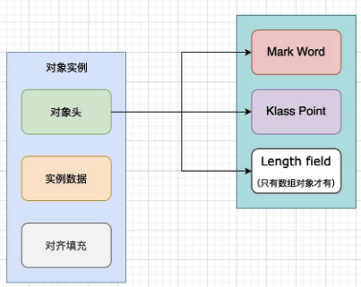

## Java对象内存布局
要了解Synchronized的原理，必须了解Java对象内存布局。


Hotspot 官方文档 对 object header的描述
Common structure at the beginning of every GC-managed heap object. (Every oop points to an object header.) Includes fundamental information about the heap object's layout, type, GC state, `synchronization state`, and identity hash code. Consists of `two words`. In arrays it is immediately followed by a length field. Note that both Java objects and VM-internal objects have a common object header format.

对象头中那两个字分别是 mark word 和 klass pointer。
Mark Word


- 锁标志位（lock）：区分锁状态，11时表示对象待GC回收状态, 只有最后2位锁标识(11)有效。
- biased_lock：是否偏向锁，由于正常锁和偏向锁的锁标识都是 01，没办法区分，这里引入一位的偏向锁标识位。
- 分代年龄（age）：表示对象被GC的次数，当该次数到达阈值的时候，对象就会转移到老年代。
- 对象的hashcode（hash）：运行期间调用System.identityHashCode()来计算，延迟计算，并把结果赋值到这里。当对象加锁后，计算的结果31位不够表示，在偏向锁，轻量锁，重量锁，hashcode会被转移到Monitor中。
- 偏向锁的线程ID（JavaThread）：偏向模式的时候，当某个线程持有对象的时候，对象这里就会被置为该线程的ID。 在后面的操作中，就无需再进行尝试获取锁的动作。
- epoch：偏向锁在CAS锁操作过程中，偏向性标识，表示对象更偏向哪个锁。
- ptr_to_lock_record：轻量级锁状态下，指向栈中锁记录的指针。当锁获取是无竞争的时，JVM使用原子操作而不是OS互斥。这种技术称为轻量级锁定。在轻量级锁定的情况下，JVM通过CAS操作在对象的标题字中设置指向锁记录的指针。
- ptr_to_heavyweight_monitor：重量级锁状态下，指向对象监视器Monitor的指针。如果两个不同的线程同时在同一个对象上竞争，则必须将轻量级锁定升级到Monitor以管理等待的线程。在重量级锁定的情况下，JVM在对象的ptr_to_heavyweight_monitor设置指向Monitor的指针。

Klass Pointer
即类型指针，是对象指向它的类元数据的指针，虚拟机通过这个指针来确定这个对象是哪个类的实例。

HotSpot VM的自动内存管理系统要求对象起始地址必须是8字节的整数倍. 字段内存对齐的其中一个原因，是让字段只出现在同一CPU的缓存行中。 如果字段不是对齐的，那么就有可能出现跨缓存行的字段。也就是说，该字段的读取可能需要替换两个缓存行，而该字段的存储也会同时污染两个缓存行。这两种情况对程序的执行效率而言都是不利的。填充的最终目的是为了计算机高效寻址。

## Synchronized底层实现
在Java虚拟机(HotSpot)中，monitor是由ObjectMonitor实现的，其主要数据结构如下（位于HotSpot虚拟机源码ObjectMonitor.hpp文件，C++实现）
```
  ObjectMonitor() {
    _header       = NULL;
    _count        = 0; //记录个数
    _waiters      = 0,
    _recursions   = 0;
    _object       = NULL;
    _owner        = NULL;
    _WaitSet      = NULL; //处于wait状态的线程，会被加入到_WaitSet
    _WaitSetLock  = 0 ;
    _Responsible  = NULL ;
    _succ         = NULL ;
    _cxq          = NULL ;
    FreeNext      = NULL ;
    _EntryList    = NULL ; //处于等待锁block状态的线程，会被加入到该列表
    _SpinFreq     = 0 ;
    _SpinClock    = 0 ;
    OwnerIsThread = 0 ;
  }
```

## synchronized修饰代码块底层原理
```
  public class TestSafeAddI {
    public int i;

    public void addI() {
        synchronized (this) {
            i++;
        }
    }
}
```


